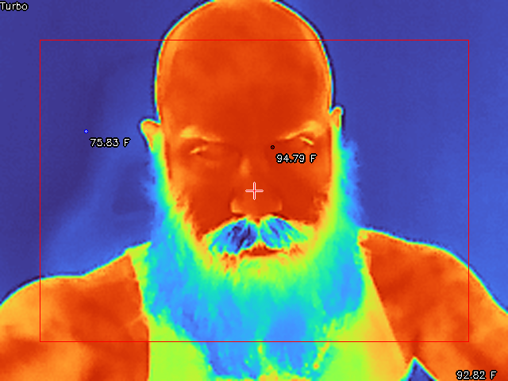

# cppThermalCamera

read the thermal data from a topdon TC001 thermal camera




# Controls

```shell
cppThermalCamera v0.1.1
keymap:
     i  | toggle information (display [thermal area outline, colormap name])
     c  | toggle crosshair
     x  | change crosshair color
     w  | toggle temp conversion
    h l | toggle High/Low points
    b n | thermal area - +
     m  | cycle through Colormaps
     p  | save frame to PNG file
    r t | record / stop Video avi file
     q  | quit
```

# Resources

* [eevBlog](https://www.eevblog.com/forum/thermal-imaging/infiray-and-their-p2-pro-discussion/msg4665403/#msg4665403) encoding
* [eevBlog](https://www.eevblog.com/forum/thermal-imaging/infiray-and-their-p2-pro-discussion/msg4666756/#msg4666756) Temperature conversion

